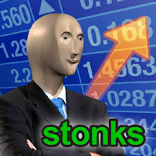
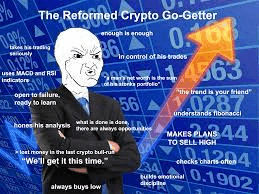

```{r setup, include=FALSE}
knitr::opts_chunk$set(echo=TRUE, message=FALSE, warning=FALSE, error=FALSE)
library(magick)
```

```{css}
body {
  font-family: "Arial", sans-serif;
  background-color: #f0f0f0;
}

h1 {
  color: #832527;
}

h2 {
  font-style: italic;
}

p {
  line-height: 1.2;
}
```

## Project requirements
### GitHub Integration

- **Repository Creation**: I have created a GitHub repository as mentioned in the instructions to store my project folder.

- **Committing Code**: I have committed my project folder to the GitHub repo and made it public for feedback.

### Links

- **Link to Repository**: [GitHub Repo](https://github.com/prontOh/stats220)

By creating a GitHub repository, committing my code, and optionally deploying a GitHub Pages website, I have met the requirements for working with GitHub and GitHub Pages.


## My meme

### Inspiration Meme



#### Key Components and Changes

I recreated the stonk meme by overlaying the stonk man image onto the stonk image and added new text and color. The key components and changes include:

- **Text**: Annotated the blank canvas to add a new piece of text.
- **Overlaying entire meme on canvas**: overlayed the meme just below the canvas to display the text as a header for the meme.
- **Positioning**: Positioned the stonk man image over the stonk image using the `image_composite()` function.
- **Position of Stonk**: Changed the position of stonk man using `offset` attribute.

```{r meme-code, eval=TRUE}
canvas <- image_blank(300, 30, color = "blue") %>% 
  image_annotate( text = "My crypto wallet rn", color = "#FFFFFF", size = 20, gravity = "center")

stonk <- image_read("https://encrypted-tbn0.gstatic.com/images?q=tbn:ANd9GcRHxqIncrc3eqZutXggAjwvAvdins_IrB1_og&usqp=CAU")

stonk <- image_scale(stonk, "300x300!")

# This is a comment to show i can comment

stonk_man <- image_read("https://encrypted-tbn0.gstatic.com/images?q=tbn:ANd9GcSmO3rkSHlyDOmVpVBZl6a0sEsJkDXZ3p0iHw&usqp=CAU")
overlay <- image_scale(stonk_man, "230x170")

meme <- image_composite(stonk, overlay, offset = "+170+120")

meme <- c(canvas, meme)
meme <- image_append(meme, stack = TRUE)
image_write(meme, "my_meme.png")

```


```{r animation-code, eval=FALSE}
img1 <- image_read("img1.jpeg")
img2 <- image_read("img2.jpeg")
img3 <- image_read("img3.png")
img4 <- image_read("img4.jpeg")

frames <- c(img2, img3, img1, img4)

gif <- frames %>% image_animate(fps=1)
image_write(gif, "my_animation.gif")

```



## Creativity
  
#### Description

Here is how my project demonstrates creativity:

1. **Exploration of Advanced {magick} Functions**: I went beyond the basic functions covered in lectures/labs and explored more advanced functions provided by the {magick} package. For example, I used the function `image_composite()` to overlay an image over the other and its attribute `offset` to manipulate the position of the image, adding complexity and visual interest to the meme.

2. **Incorporation of Additional Context**: In creating the meme and animated GIF, I added many different images to make them more humorous.Such as in the gif, I tried telling a humorous story by carefully selecting the right image for the right frame. Moreover, creatively positioning the overlay image and adding text annotations made the meme very creative.

3. **CSS for Presentation**: I customized font styles, colors, and layout to create a visually appealing report.


## Learning reflection

#### Important Ideas Learned from Module 1

I learned that Markdown provides a simple and efficient way to write formatted text and Rmd extends Markdown by enabling the incorporation of R code, output, css etc, directly into the document. This helps us to easily create data analysis reports and presentations.

#### My Curiosity

My main curiosity is learning more about R for data manipulation and analysis and increase my visualization skills on Rmd.

1. **More Libraries**: I want to explore advanced techniques for creating interactive visualizations. Learning more about different libraries will enhance my skill in R further.

2. **Data Manipulation and Analysis**: I am adamant on learning more about data manipulation and analysis techniques in R. Especially if there is any machine learning algorithm in R for quick data predictions.

